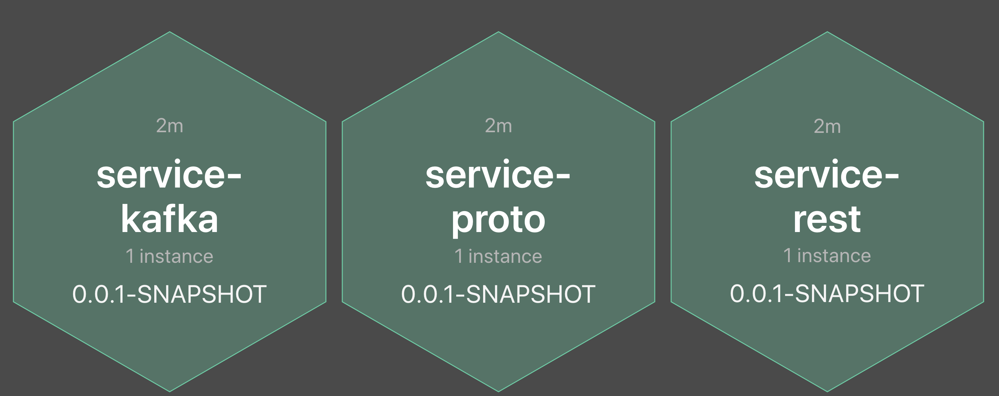

# BOOTiful Microservices
Spring-boot based Microservice platform with 
- Distributed messaging ([Apache Kafka](https://kafka.apache.org/))
- Distributed logging ([Fluentd](https://www.fluentd.org/), [OpenDistro Elasticsearch](https://opendistro.github.io/for-elasticsearch-docs/))
- Distributed tracing ([Jaeger](https://www.jaegertracing.io/))
- Metrics collection and visualization ([Prometheus](https://prometheus.io/), [Loki](https://grafana.com/oss/loki/), [Grafana](https://grafana.com/))
- Rest endpoint documentation using Swagger and OpenAPI
- AWS lambda function running locally in [Localstack](https://github.com/localstack/localstack) 

## CI and CD
- Jenkins CICD pipeline is included in every service that will build and deploy the service
- Ability to switch build profile at build time using Maven profiles for either
    - Container platform
    - AWS Lambda

# Pre-requisite
- JDK 11 compiler
- Maven > 3.5.0
- Docker > 1.18 (Docker desktop on Windows and MacOS will work)
- Docker compose (latest version. Comes with Docker desktop)
- Kubernetes is turned on in Docker Desktop

# Understanding components in this project
## Spring boot pom parent (anair-pom-parent)
- Parent pom that manages commonly used dependencies and plugins. 
- All services in this project will extend from this parent pom.
- [Read more...](anair-pom-parent/README.md)

## Spring boot Rest Maven archetype (anair-rest-archetype) 
- Template project that can be used to generate a Restful spring boot application with sample java classes, properties
- [Read more...](anair-rest-archetype/README.md)

## Spring boot services
- [Admin console](anair-service-admin/README.md)
    - Spring boot services admin console
- [Rest Service](anair-service-rest/README.md)
    - Exposes a rest endpoint
    - Publishes a message on a Kafka topic
    - Invoke a GET grpc endpoint
- [Kafka client](anair-service-kafka/README.md)
    - Consumes message from the Kafka topic published by Service A
- [Protobuf Service](anair-service-proto/README.md)
    - Expose grpc endpoint producing protobuffer content when invoked by Service A
- [Lambda Function](anair-fn/README.md)
    - AWS lambda Fn invoked using SQS and/or CloudWatch event. Creates a S3 file and sends a message to an outbound SQS queue

## Logging
Publish application and system logs to a centralized server.
- Logs from applications and systems are collected by [Fluentd](https://www.fluentd.org/)
    - Review fluentd conf at _logging/fluentd/conf/fluent.conf_ that has elasticsearch and loki outputs
- Fluentd publishes the logs to [OpenDistro Elasticsearch](https://opendistro.github.io/for-elasticsearch-docs/) server and Loki
- Visualize logs in Kibana
- Visualize logs in Grafana using Loki datasource

## Metrics
- [Read more on Metrics...](metrics/README.md)

# Infrastructure services
The spring boot microservices integrates with the following infrastructure components:
- [Jaeger](https://www.jaegertracing.io/) (Distributed tracing)
- [Prometheus](https://prometheus.io/) (Time-series metrics collector)
- [Loki](https://grafana.com/oss/loki/) (Index free log collector just like Prometheus)
- [Grafana](https://grafana.com/) (View Prometheus metrics and Loki logs)
- [OpenDistro Elasticsearch and Kibana](https://opendistro.github.io/for-elasticsearch-docs/) (Distributed logging)
- [AWS Localstack](https://github.com/localstack/localstack)

# Middleware services
The spring boot microservices integrates with the following middleware components:
- [Apache Zookeeper](https://zookeeper.apache.org/) (Distributed coordination for Kafka)
- [Apache Kafka](https://kafka.apache.org/) (Distributed messaging)

# Running microservices
## In a Docker environment
1. Navigate to this project
1. Review _docker-compose.yml_ and _docker-compose-infra.yml_ files
1. Run `mvn clean package` on anair-service-rest, anair-service-kafka, anair-service-proto, anair-service-admin. This has to be done anytime code is changed and has to be deployed in docker.
1. Run `docker-compose -f docker-compose-infra.yml up` to start infrastructure services:
    - Jaeger
    - Elasticsearch
    - Kibana
    - Prometheus
    - Prometheus node exporter
    - cAdvisor
    - Loki
    - Grafana
    - Localstack (AWS stack)
1. Run `docker-compose -f docker-compose-middleware.yml up` to start middleware services:
    - Fluentd
    - Zookeeper
    - Kafka
1. Run `docker-compose up` to start microservices:
    - Spring boot admin
    - Rest Service
    - Kafka Service 
    - Protobuf Service
1. Verify that the below mentioned URls are accessible

## Urls
- [Jaeger](http://localhost:16686)
- [Prometheus](http://localhost:9090)
- [Grafana](https://localhost:3000)
    - Login initially as admin/admin. If asked to enter new password, skip or change.
- [cAdvisor](http://localhost:8090)
- [Kibana](https://localhost:5601)
    - Login as admin/admin    
- [Swagger - Rest Service](http://localhost:8081/anair-service-rest/swagger-ui.html)
- [Swagger - Protobuf Service](http://localhost:8083/anair-service-proto/swagger-ui.html)
- [Spring boot admin](http://localhost:18080/admin)
    - Login as admin/admin
- [Localstack](http://localhost:8088)

# Executing service endpoints
- In Service A swagger page, try out __/publish/{userId}__ endpoint. This will execute a kafka and grpc transaction. Check logs of all 3 services. View the trace graph in Jaeger UI.
