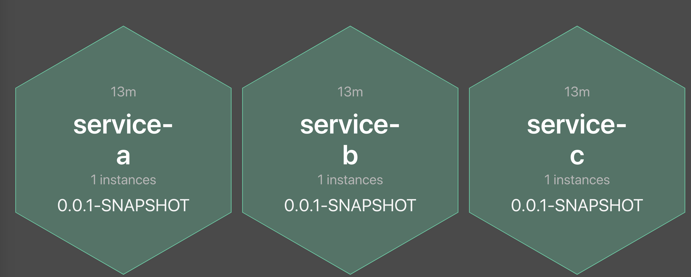
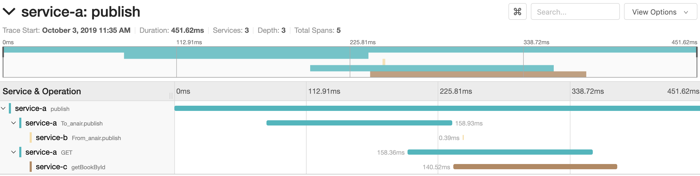

# BOOTiful Microservices
Spring-boot based Microservice platform that includes distributed messaging, distributed tracing, metrics collection and visualization.

# Understanding components in this project
## Spring boot parent pom
- anair-parent-pom is the parent pom that manages commonly used dependencies and plugins. 
- All services in this project will extend from this parent pom.
- [Read more...](anair-parent-pom/README.md)

## Spring boot Rest Maven archetype
- Template project that can be used to generate a Restful spring boot application with sample java classes, properties
- [Read more...](anair-rest-archetype/README.md)

## Spring boot services
- [Admin console](anair-service-admin/README.md)
    - Spring boot services admin console
- [Service A](anair-service-a/README.md)
    - Publishes a message on a Kafka topic
    - Invoke a GET grpc endpoint
- [Service B](anair-service-b/README.md)
    - Consumes message from the Kafka topic published by Service A
- [Service C](anair-service-c/README.md)
    - grpc endpoint producing protobuffer content when invoked by Service A

# Infrastructure services
The above microservices integrates with the following infrastructure components:
- [Apache Zookeeper](https://zookeeper.apache.org/) (Distributed coordination for Kafka)
- [Apache Kafka](https://kafka.apache.org/) (Distributed messaging)
- [Jaeger](https://www.jaegertracing.io/) (Distributed tracing)
- [Prometheus](https://prometheus.io/) (Time-series metrics collector)
- [Grafana](https://grafana.com/) (Metrics UI)

# Running services
## In Docker environment
- Navigate to this project
- Review _docker-compose.yml_ file
- Run `mvn clean package` on anair-service-a, anair-service-b, anair-service-c, anair-service-admin. This has to be done anytime code is changed and has to be deployed in docker.
- Run `docker-compose up` to start 
    - infrastructure services:
        - Jaeger
        - Zookeeper
        - Kafka
        - Prometheus
        - Prometheus node exporter
        - CAdvisor
        - Grafana
        
    - microservices:
        - Spring boot admin
        - Service A
        - Service B
        - Service C
- Verify that the below mentioned URls are accessible
- [Read more on Metrics](metrics/README.md)

## Urls
- [Jaeger UI](http://localhost:16686)
- [Prometheus](http://localhost:9090)
- [Grafana](https://localhost:3000)
    - Login as admin/admin
- [Swagger UI - Service A](http://localhost:8080/anair-service-a/swagger-ui.html)
- [Swagger UI - Service C](http://localhost:8082/anair-service-c/swagger-ui.html)
- [Spring boot admin](http://localhost:18080/admin)
    - Login as admin/admin

# Executing service endpoints
- In Service A swagger page, try out __/publish/{userId}__ endpoint. This will execute a kafka and grpc transaction. Check logs of all 3 services. View the trace graph in Jaeger UI.
- Here is the opentrace graph from Jaeger:

